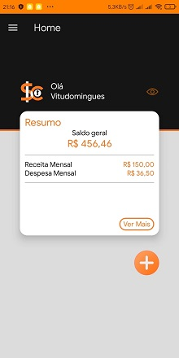

<p align="center"></p>
  
---
  
<p align="center"> </p>
  
# OBJETIVO

Permitir um planejamento financeiro de pessoas que tem o consumo desenfreado, mais comumente em jovens, através de um App, definindo metas e objetivos a curto e longo prazo, organizar o seu dinheiro destinando uma porcentagem para cada objetivo como gastos fixos, gastos pessoais e gastos para prioridades financeiras, proporcionando estabilidade financeira para alcançar seus sonhos e a capacidade de superar imprevistos.

## Execusão

Após clonar o repositório, entrar na pasta SafeCash, e executar os comandos desejados de visualisação do expo.
  
```
yarn start
```

Usando o yarn start você deverar precionar a tecla de acordo com a preferência de execução:
  
* a para abrir no android.
* w para abrir o preview web.
* shift+a para selecionar um dispositivo ou emulador.
* c para mostrar o QR Code do projeto
  
Para executar a aplicação pelo aplicativo expo no seu smartphone, execute o seguinte comando,
  
```
yarn start --tunnel
```
  
Após isso é so escanear com o expo o QR Code mostrado no terminal.
